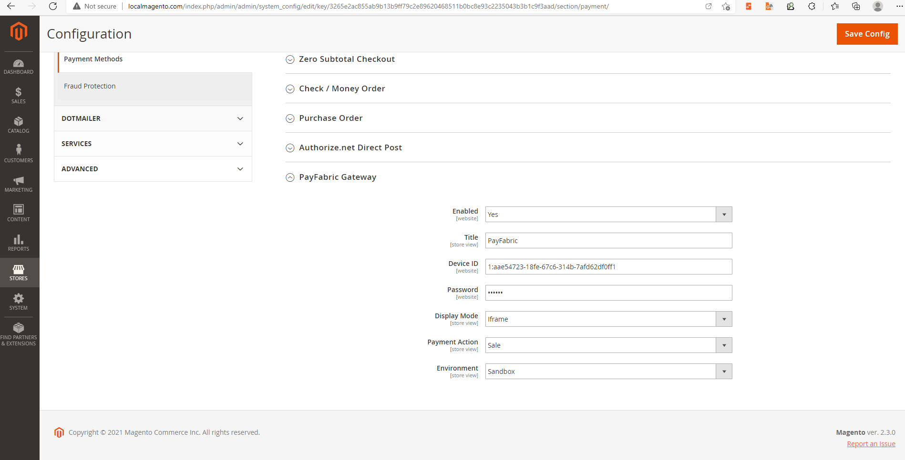
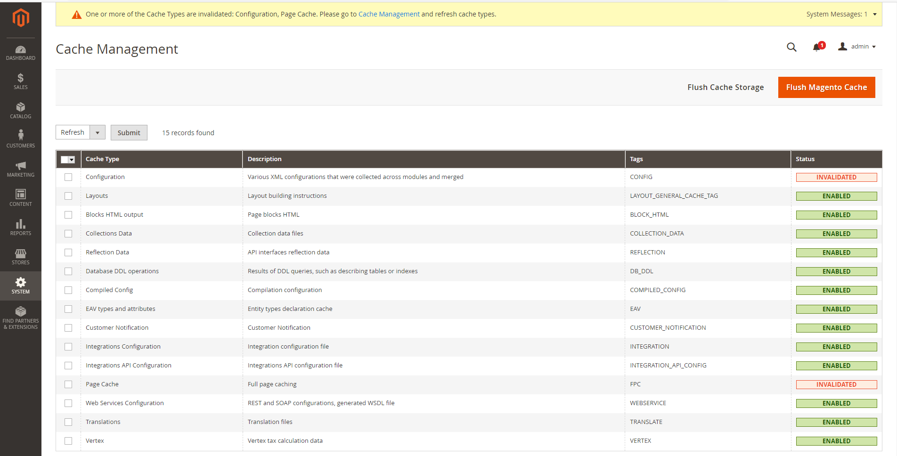
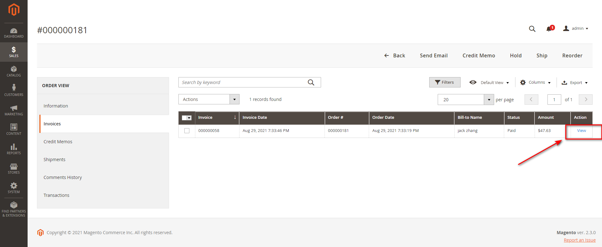
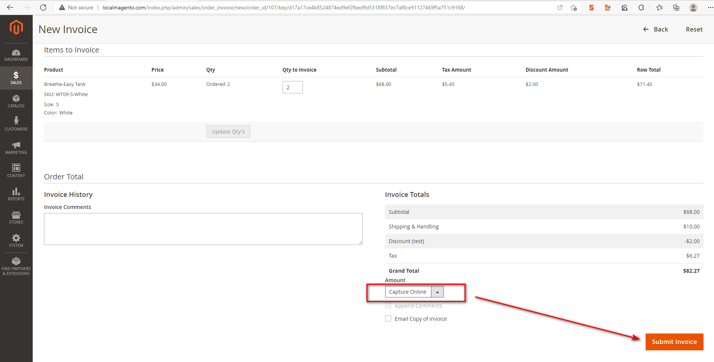
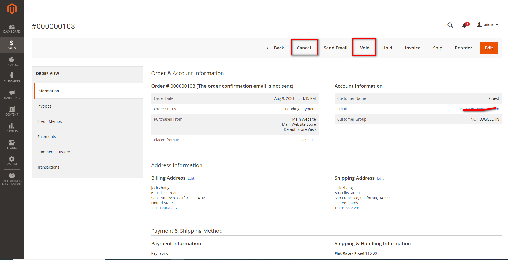
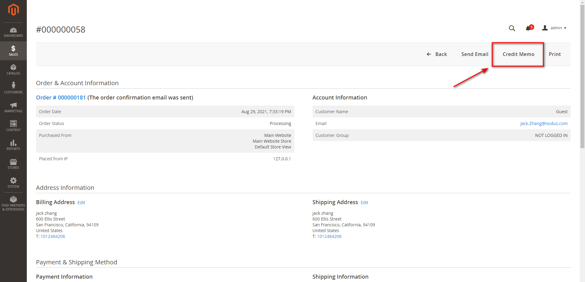
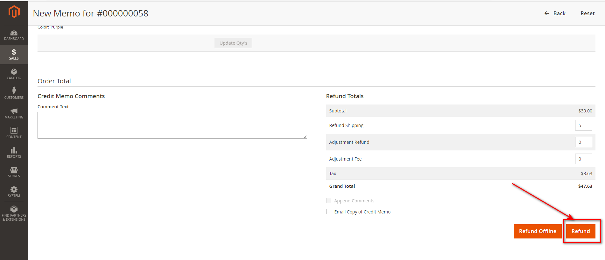

## PayFabric gateway plugin for Magento 2.x 
Requires Magento version 2.x

## Description 
PayFabric gateway plugin for Magento provides eCommerce extensions that allow you to add payment processing capabilities into supported eCommerce platforms without any custom coding.

## Installation 
Before installing please take a full backup of your website.
1. Download the extension.
2. Upload the extension to the app/code folder of your Magento root directory via FTP/SSH.
3. Enable the extension and clear the static view files. bin/magento module:enable PayFabric_Payment --clear-static-content
4. Register the extension and initiate the database migrations. bin/magento setup:upgrade
5. Recompile the Magento project. bin/magento setup:di:compile
6. Clear the Magento store’s cache. bin/magento cache:flush

## Configuration
* Go to STORES > Configuration > Sales > Payment Methods to set your gateway and save config.

* Go to System > Cache Management to flush Magento cache.

## Capture
For authorized transactions you can create capture directly in Magento. To do this open an order and click on Invoice button at the top right side.

Once on the Invoice page, scroll down to the bottom, choose "Capture Online" dropdown menu and click on "Submit Invoice" button.

## Void
For authorized transactions you can void directly in Magento. To do this open an order and click on "Void" or "Cancel" button at the top right side.

## Refund
For paid transactions you can create refund directly in Magento. To do this open the invoice of the captured order.

Then click on Credit Memo on the TOP RIGHT side menu.

Once on the credit memo screen click "Refund".

