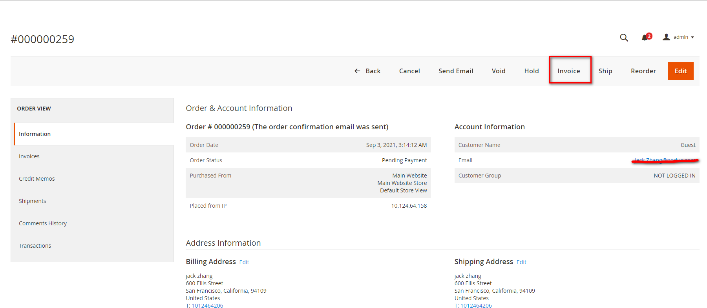

## PayFabric gateway plugin for Magento 2.3 or higher
Requires Magento version 2.3 or higher

## Description 
PayFabric gateway extension allows you to add payment processing capabilities into Magento2.3 or higher without any custom coding.

## Installation 
Before installing please take a full backup of your website.
1. Download the extension zip file.
2. Unzip the extension and upload the PayFabric folder to your <Magento root directory>/app/code via FTP/SSH.
3. Enable the extension and clear the static view files by running the command.
    bin/magento module:enable PayFabric_Payment --clear-static-content
4. Register the extension and initiate the database migrations by running the command.
    bin/magento setup:upgrade
5. Recompile the Magento project by running the command.
    bin/magento setup:di:compile
6. Clear the Magento store’s cache by running the command.
    bin/magento cache:flush

## Configuration
* Go to STORES > Configuration > Sales > Payment Methods to set your gateway and save config.

* Go to System > Cache Management to flush Magento cache.

## Capture
For authorized transactions you can create capture directly in Magento, the authorized transaction order status is "On Hold", so please open the order and click on "Unhold" button before the next step, then click on "Invoice" button at the top right side.

On the invoice page, scroll down to the bottom, choose "Capture Online" dropdown menu and click on "Submit Invoice" button.

## Void
For authorized transactions you can void directly in Magento, the authorized transaction order status is "On Hold", so please open the order and click on "Unhold" button before the next step, then click on "Void" or "Cancel" button at the top right side.

## Refund
For paid transactions you can create refund directly in Magento. To do this open the invoice of the captured order.

Then click on Credit Memo on the top right side menu.

On the credit memo page click "Refund".

